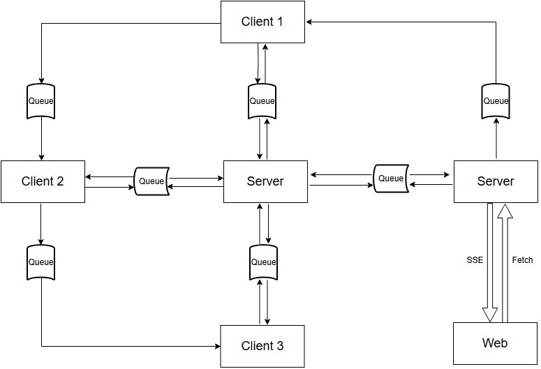

# Tóm tắt cả hệ thống
Web (Client) sẽ bóc tách video đầu vào thành các frame còn nếu là ảnh thì chính là 1 frame, sau đó gửi từng frame về thông qua Fetch cho Server của Web lấy rồi gửi qua hàng đợi thông qua RabbitMQ, phía sau Client 1 của model AI thông qua RabbitMQ sẽ liên tục lên hàng đợi đó lấy từng frame về và chạy inference luôn rồi truyền cho Client 2 thông qua RabbitMQ rồi Client 3 thông qua RabbitMQ sẽ gửi dự đoán về theo từng mảng cho Server của model AI xử lý (mỗi frame sẽ tương ứng với 1 mảng chứa các dự đoán), sau đó trên Web (Client) sẽ gửi vị trí ghi nhận dữ liệu thông qua Fetch về cho Server của Web lấy rồi gửi lên hàng đợi thông qua RabbitMQ, Server của model AI thông qua RabbitMQ lên hàng đợi đó lấy về, sau đó xử lý dữ liệu dự đoán cùng dữ liệu tại vị trí đó, rồi thông qua RabbitMQ gửi lên hàng đợi để Server của Web thông qua RabbitMQ lấy về rồi gửi qua SSE cho Web (Client) lấy rồi hiển thị lên bản đồ.

## Model


## Install the AI ​​model side packages
```
certifi            2025.11.12
matplotlib         3.10.7
numpy              2.2.6  
opencv-python      4.12.0.88
pip                25.3 
PyYAML             6.0.3
requests           2.32.5 
torch              2.9.1  
torchvision        0.24.1 
ultralytics        8.3.228
ultralytics-thop   2.0.18 
urllib3            2.5.0 
```

## Install web-side packages
```
  amqplib       0.10.9
  body-parser   2.2.0
  cors          2.8.5
  dotenv        17.2.3
  ejs           3.1.10
  express       5.1.0
  multer        2.0.2
```

# split_inference

## Configuration
Application configuration is in the `config.yaml` file:
```yaml
name: YOLO
server:
  cut-layer: a #or b, c
  clients:
    - 1
    - 1
    - 1
  model: yolov8_version1 # trained model for urban flood identification problem
  batch-frame: 1
rabbit:
  address: 127.0.0.1
  username: admin
  password: admin
  virtual-host: /

data: video.mp4 
nc: 4 # number of class
log-path: .
control-count: 10
debug-mode: False
```

This configuration is use for server.

## How to Run
Alter your configuration, you need to run the server to listen and control the request from clients.

```commandline
python3 server.py or python server.py
```

Now, when server is ready, run clients simultaneously with total number of client that you defined.


**Layer 1**

```commandline
python3 client.py --layer_id 1 or python client.py --layer_id 1 
```


**Layer 2**

```commandline
python3 client.py --layer_id 2 or python client.py --layer_id 2 
```


**Layer 3**

```commandline
python3 client.py --layer_id 3 or python client.py --layer_id 3 
```

**Web**

```commandline
node server.js 
```


Where:
- `--layer_id` is the ID index of client's layer, start from 1. 


If you want to use a specific device configuration for the training process, declare it with the `--device` argument when running the command line:

```commandline
python client.py --layer_id 1 --device cpu
```


## Result
Results include inference time, operating time, utilization. It locates in `result.log`.  
```commandline
2025-04-16 23:51:35,944 - my_logger - INFO - Start Inference
2025-04-16 23:51:35,982 - my_logger - INFO - FPS input: 30.0
2025-04-16 23:54:12,896 - my_logger - INFO - End Inference.
2025-04-16 23:54:12,899 - my_logger - INFO - All time: 156.95556831359863s
2025-04-16 23:54:12,900 - my_logger - INFO - Inference time: 152.65051984786987s
2025-04-16 23:54:12,900 - my_logger - INFO - Utilization: 97.26 % (là tỉ lệ time inference/ all time)
```